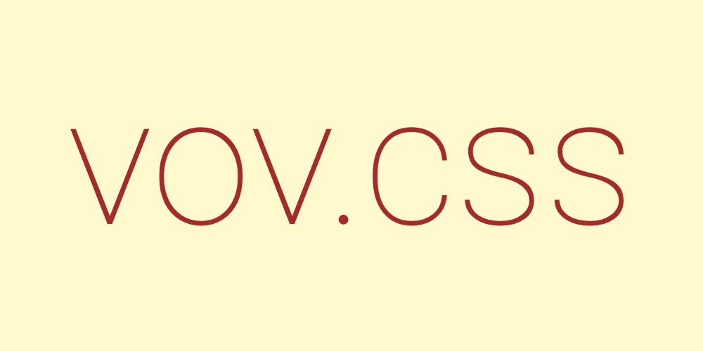

vov.css       
=======

[](https://gitter.im/vov-css/community?utm_source=badge&utm_medium=badge&utm_campaign=pr-badge&utm_content=badge)

#### You can install the file
```html
<head>
  <link rel="stylesheet" href="animate.min.css">
</head>
```

#### Instead of installing you can also use the cdn
```html
<link href="https://cdn.jsdelivr.net/gh/vaibhav111tandon/vov.css@latest/vov.css" rel="stylesheet" type="text/css">
```

#### Or use the minified version by adding 
```html
<link href="https://cdn.jsdelivr.net/gh/vaibhav111tandon/vov.css@latest/vov.min.css" rel="stylesheet" type="text/css">
```


| Class Name             |                         |      Fading Animations    |                        |
| ---------------------- | ----------------------- | ------------------------- | ---------------------- |
| `fade-in-bottom-left`  | `fade-in-bottom-right`  | `fade-in-down`            | `fade-in-left`         |
| `fade-in-right`        | `fade-in-top-left`      | `fade-in-top-right`       | `fade-in-up`           |
| `fade-in`              | `fade-out-bottom-left`  | `fade-out-bottom-right`   | `fade-out-down`        |
| `fade-out-left`        | `fade-out-right`        | `fade-out-top-left`       | `fade-out-top-right`   |
| `fade-out-up`          | `fade-out`              |

---------------------------------------------------------------------------------------------------------


| Class Name             |                         |      Rolling Animations   |                        |
| ---------------------- | ----------------------- | ------------------------- | ---------------------- |
| `roll-in-left`         | `roll-in-right`         | `roll-out-left`           | `roll-out-right`       |

---------------------------------------------------------------------------------------------------------


| Class Name             |    Shaking Animations   |
| ---------------------- | ----------------------- |
| `shake-vertical`       | `shake-horizontal`      |

---------------------------------------------------------------------------------------------------------


| Class Name             |    Blur Animations      |
| ---------------------- | ----------------------- |
| `blur-in`              | `blur-out`              |

---------------------------------------------------------------------------------------------------------


| Class Name             |                         |      Sliding Animations   |                        |
| ---------------------- | ----------------------- | ------------------------- | ---------------------- |
| `slide-in-down`        | `slide-in-left`         | `slide-in-right`          | `slide-in-up`          |
| `slide-out-down`       | `slide-out-left`        | `slide-out-right`         | `slide-out-up`         |

---------------------------------------------------------------------------------------------------------


| Class Name             |                         |      Zooming Animations   |                        |
| ---------------------- | ----------------------- | ------------------------- | ---------------------- |
| `zoom-in-down`         | `zoom-in-left`          | `zoom-in-right`           | `zoom-in-up`           |
| `zoom-in`              | `zoom-out-down`         | `zoom-out-left`           | `zoom-out-right`       |
| `zoom-out-up`          | `zoom-out`              |

---------------------------------------------------------------------------------------------------------


| Class Name             |    Throbing Animations      |
| ---------------------- | --------------------------- |
| `throb`                | `i-throb`                   |

---------------------------------------------------------------------------------------------------------


| Class Name             |                           |      Swivel Animations    |                         |
| ---------------------- | ------------------------- | ------------------------- | ----------------------- |
| `swivel-horizontal`    | `swivel-horizontal-double`|  `swivel-vertical`        | `swivel-vertical-double`|

------------------------------------------------------------------------------------------------------------

| Class Name             |                           |      Wheel Animations     |                         |
| ---------------------- | ------------------------- | ------------------------- | ----------------------- |
| `wheel-in-left`        | `wheel-in-right`          |  `wheel-out-left`         | `wheel-out-right`       |

------------------------------------------------------------------------------------------------------------

|  Other Animations      |
| ---------------------- | 
| `flash`                |

---------------------------------------------------------------------------------------------------------

## Usage

Either install the file
OR
Just add the cdn in the head of your html. Start using the library by applying the different classes

Add the class `vov` to the element you want to animate 

```html
<h1 class="vov flash">sample animations</h1>
```
### Animation duration

To vary the animation-duration

| Class Name             |    Time                 |
| ---------------------- | ----------------------- |
| `fastest`              | `300ms`                 |
| `faster`               | `500ms`                 |
| `fast`                 | `800ms`                 |
| `slow`                 | `2s`                    |
| `slower`               | `3s`                    |
| `slowest`              | `4s`                    |


```html
<h1 class="vov flash fastest">sample animations</h1>
<h1 class="vov flash faster">sample animations</h1>
<h1 class="vov flash fast">sample animations</h1>
<h1 class="vov flash slow">sample animations</h1>
<h1 class="vov flash slower">sample animations</h1>
<h1 class="vov flash slowest">sample animations</h1>
```

To make the iteration count infinite

```html
<h1 class="vov flash infinite">sample animations</h1>
```

### Animation Delay

To animation-delay use class t-1, t-2, t-3, t-4, t-5 where the number the denotes the seconds delay

```html
<h1 class="vov flash t-5">sample animations</h1>
```

